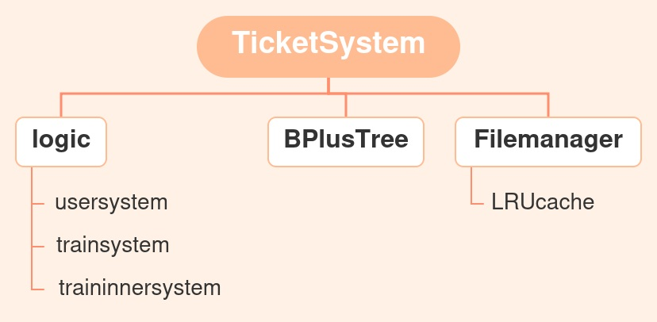
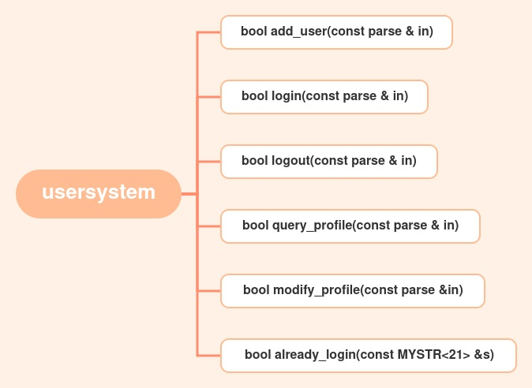
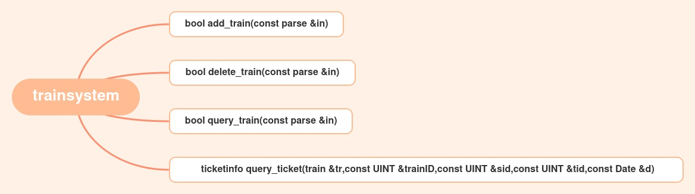
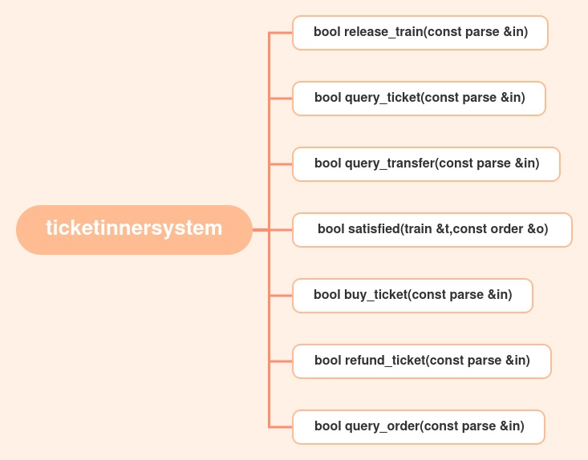

# TicketSystem-test
#### 开发人员

| 组员                                                         | 分工           |
| ------------------------------------------------------------ | :------------- |
| 翟明舒([@zhaimingshuzms](https://github.com/zhaimingshuzms)) | 后端逻辑       |
| 杨心阳([@Monta](https://github.com/Montayang))               | 后端B+树，缓存 |

#### 后端架构

- 
- 
- 
- 